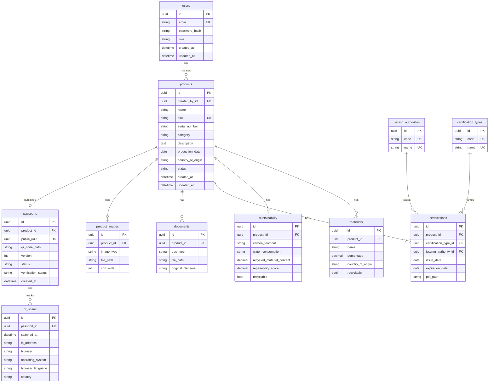

# Database

Draft schema for the DPP API. Implement next with SQLAlchemy + Alembic.

## Ways to store a value (simple)

| Approach | What it is | Good when |
|----------|------------|-----------|
| **Free text** | User types anything into a string column | Names, descriptions — every value is different |
| **Enum** | Fixed short list in code/DB (`draft` / `published`) | List almost never changes; 2–10 values |
| **Lookup table** | Extra table of allowed rows; other tables store an **id** pointing to it | List can grow; you want dropdowns + filter/search by that value |
| **ISO code (no table)** | Store a standard code like `DE`; validate with a list in code | World standards already exist (countries); no need to own the list in DB |

**Enum vs lookup (same idea, different place):**  
Both mean “pick from a list.” Enum = list lives in code. Lookup = list lives in the database (seed data, easy to add rows, easy `WHERE authority_id = …`).

---

## Final decisions

| Field | Decision | Why |
|-------|----------|-----|
| `users.role` | **Enum** `admin` \| `editor` | Only 2 values; brief-defined |
| `products.status` | **Enum** `draft` \| `published` | Only 2 values |
| `products.category` | **Enum** (fixed set we define, e.g. electronics, textile, …) | Small fixed product types for the demo |
| `documents.doc_type` | **Enum** `user_manual` \| `warranty` \| `technical_datasheet` | Brief lists exactly these |
| `product_images.image_type` | **Enum** `cover` \| `gallery` | Only 2 |
| `passports.status` / `verification_status` | **Enum** | Small fixed sets |
| Country (`products`, `materials`, scans) | **ISO code** string (`DE`, `FR`, …) + list in code | Standard world list; no DB table to maintain |
| `issuing_authorities` | **Lookup table** | Can grow; filter/search certs by authority |
| Certification **name** | **Lookup table** `certification_types` | Same as authority — searchable, not random free text |
| Product name, SKU, description, serial | **Free text** | Unique per product |
| Sustainability numbers / flags | **Numbers / bools** | Not a list of labels |
| File paths (PDF, images, QR) | **String path** | Files on disk under `UPLOAD_DIR` |

Seed lookup rows in a seed script (TÜV, SGS, … / ISO 9001, CE, …). Admins can add more later if we expose Settings.

---

## ERD

## Tables (short)

| Table | Role |
|-------|------|
| `users` | Login + role |
| `products` | Back-office product (`draft` / `published`) |
| `materials` | Many per product |
| `sustainability` | One per product |
| `issuing_authorities` | Lookup for cert bodies |
| `certification_types` | Lookup for cert names (ISO 9001, CE, …) |
| `certifications` | Product ↔ type + authority + dates + PDF |
| `documents` | Manual / warranty / datasheet files |
| `product_images` | Cover + gallery |
| `passports` | Public UUID + QR (created on publish) |
| `qr_scans` | Scan / view analytics |

## Other

- Files: path on disk, not bytes in Postgres.
- Soft delete: `products.deleted_at` (null = active). Active SKUs unique via partial index.
- Purge: CLI `scripts.purge_deleted_products` hard-deletes rows with `deleted_at` older than `SOFT_DELETE_RETENTION_DAYS` (and removes stored files).
- Audit log: not in v1 (bonus next).
- Dashboard: count products, passports, `qr_scans`.
- Enums store **text** (`draft`), not numbers (`1`). Easier to read; tiny size difference does not matter here.
- DB connection settings live in `.env.local` → `app/core/config.py`. No separate db config file.

## Code map (what each file does)

| File | Role |
|------|------|
| `app/core/config.py` | Reads env (DB host, password, JWT, …) |
| `app/core/enums.py` | Fixed text choices (role, status, …) |
| `app/database/base.py` | Parent class for all models |
| `app/database/session.py` | Engine + `get_db()` for requests |
| `app/database/__init__.py` | Loads all models so Alembic sees them |
| `app/users/models.py` | `User` table |
| `app/products/models.py` | Product + nested + lookup + passport tables |
| `alembic.ini` | Alembic tool config |
| `alembic/env.py` | How migrations connect and run |
| `alembic/versions/*_initial_schema.py` | SQL to create/drop tables |
